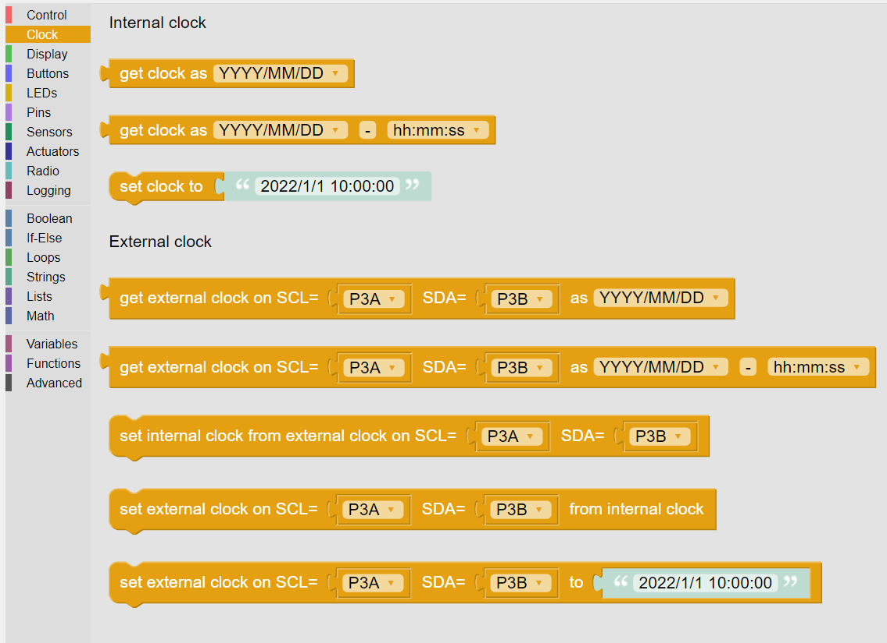
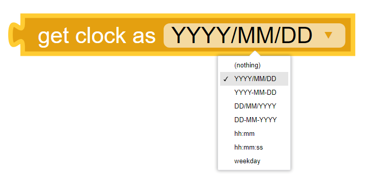
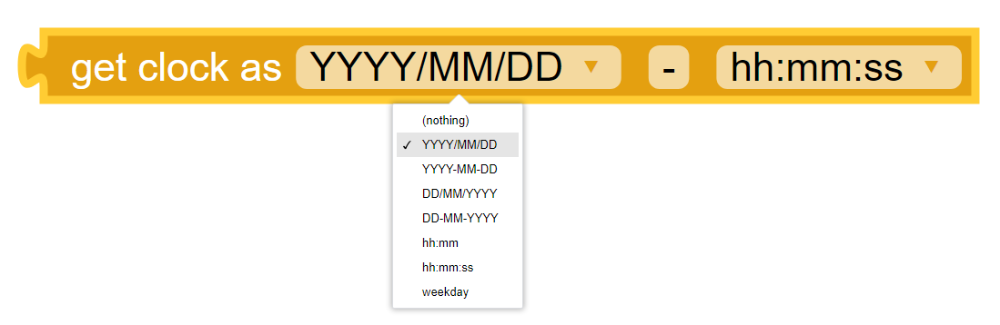
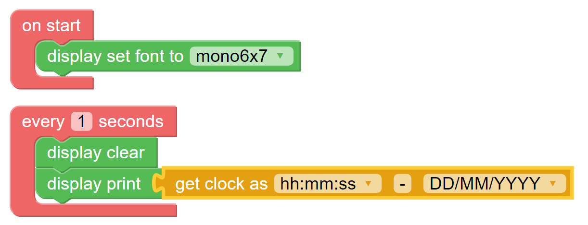
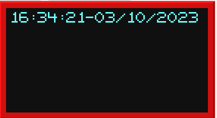
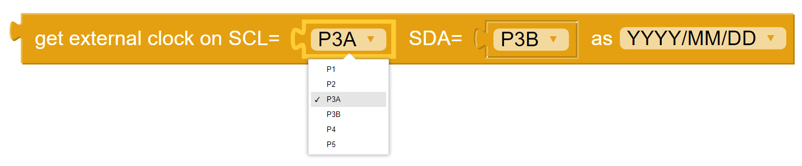
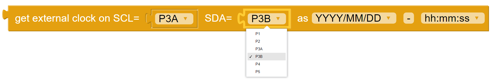
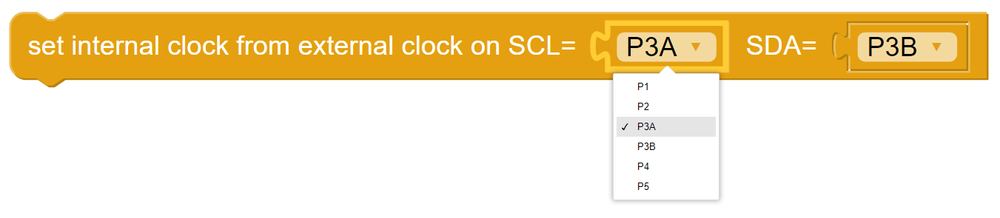
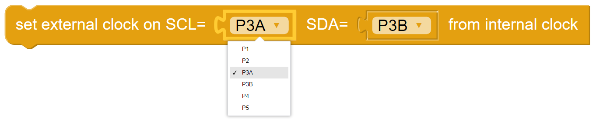
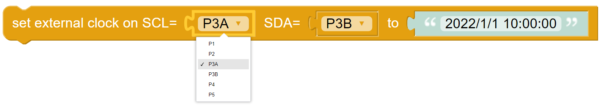

-----
Clock
-----

Clicking on the **Clock** category in the **KookaSuite** palette reveals the available blocks, as in :numref:`clkpalette`.  
Click and drag any of the required blocks to the **KookaBlocs** workspace and connect with other blocks 
to build a script that can use and/or set the time.

.. _clkpalette:

   
   The palette of **KookaBlocs** **Clock** blocks.

The blocks in the **Clock** category provide the functions to read and set the electronic real-time-clocks (**RTCs**).  

The **Kookaberry** has an internal **RTC** which defaults to a time of 00:00:00 on 1 January 2015 when the **Kookaberry** is turned on.  

The **Kookaberry** does not retain the time without external power as it has no internal battery to keep the internal clock running.

When the **Kookaberry** is connected to **KookaBlocs**, its internal **RTC** is updated to the time on the hosting computer.

An external **RTC**, connected as an accessory to the **Kookaberry**, usually has a battery and therefore maintains the time that has been previously set on it.  
This provides a convenient way for the **Kookaberry** to obtain the correct time when it is not tethered to **KookaBlocs** (or **KookaIDE** or **KookaTW**).  
The external **RTC** is connected to the **Kookaberry** using two **Pins** specified as SCL and SDA on the relevant blocks.

Each of the **Clock** blocks is described in the following sections.

Internal Clock
--------------

Get Clock – Simple Time
~~~~~~~~~~~~~~~~~~~~~~~

Reads the **Kookaberry’s** internal Real Time Clock (**RTC**) and returns a date or time in the chosen format selected from the drop-down menu on the block.  

The value returned is a character string.

Get Clock - Extended Time
~~~~~~~~~~~~~~~~~~~~~~~~~

Reads the **Kookaberry’s** internal Real Time Clock (**RTC**) and returns the date and time as a character string comprising two parts 
per the selected formats and separated by a string of characters that can be specified by the user (the default separator is the minus character ``-``).

In :numref:`clkgetextendedscript` is a **KookaBlocs** example script demonstrating a loop which updates the **Kookaberry’s** display every second with the current time and date.

.. _clkgetextendedscript:

   
   A **KookaBlocs** Script that shows the current time and date on the **Kookaberry** display.

.. _clkgetextendeddisplay:

   
   The **Kookaberry** display resulting from the example **KookaBlocs** Script in :numref:`clkgetextendedscript`.

Set Clock from Character String
~~~~~~~~~~~~~~~~~~~~~~~~~~~~~~~

This block sets the **Kookaberry’s** internal Real Time Clock (**RTC**) to the time specified by a character string in the format "YYYY/MM/YY HH:MM:SS". 

This is useful for updating the internal **RTC** with a fixed time or where the **Kookaberry** internal clock has not been 
automatically synchronised using **KookaBlocs**.

External Clock
--------------

External Clock's Pins Connections
~~~~~~~~~~~~~~~~~~~~~~~~~~~~~~~~~

The external clock is connected to the **Kookaberry** by two of the five connectors on the back, ``P1`` through to ``P5``, 
with connector ``P3`` having two possible connection points: ``P3A`` and ``P3B``. (see the :doc:`pins` category description).

The external clock block has two input **Pins** drop-down selection blocks by which the input Pin can be selected. 

It is possible to replace the **Pins** dropdown selection block with a **String** block.   
This is useful when using **Pins** other than those exposed on the rear of the **Kookaberry**, 
or when other microprocessor boards that are compatible with **Kookaberry** firmware are being used.
In those cases type in the Pin's identifier into the **String** block.

Get External Clock - Simple Time
~~~~~~~~~~~~~~~~~~~~~~~~~~~~~~~~

Reads the **Kookaberry’s** external Real Time Clock (**RTC**) and returns a date or time in the chosen format selected from the drop-down menu on the block.  

The value returned is a character string.

The external **RTC** is connected to the **Kookaberry**'s connector ports as selected from the SCL and SDA dropdown lists. 
The default setting of SCL as ``P3A`` and SDA as ``P3B`` is usually correct, meaning the external **RTC** is connected to the **Kookaberry** using the 4-pin P3 port.

Get External Clock – Extended Time
~~~~~~~~~~~~~~~~~~~~~~~~~~~~~~~~~~

Reads the *Kookaberry’s* external Real Time Clock (**RTC**) and returns the date and time as a character string comprising two parts 
per the selected formats and separated by a string of characters that can be specified by the user (the default separator is the minus character ``-``).

The external **RTC** is connected to the **Kookaberry**'s connector ports as selected from the SCL and SDA dropdown lists. 
The default setting of SCL as ``P3A`` and SDA as ``P3B`` is usually correct, meaning the external **RTC** is connected to the **Kookaberry** using the 4-pin P3 port.

Set Internal Clock from External Clock
--------------------------------------

Sets the **Kookaberry’s** internal Real Time Clock (**RTC**) by copying the current time from the external **RTC**.

The external **RTC** is connected to the **Kookaberry**'s connector ports as selected from the SCL and SDA dropdown lists. 
The default setting of SCL as ``P3A`` and SDA as ``P3B`` is usually correct, meaning the external **RTC** is connected to the **Kookaberry** using the 4-pin P3 port.

Set External Clock from Internal Clock
--------------------------------------

Sets the **Kookaberry’s** external Real Time Clock (**RTC**) by copying the current time from the internal **RTC**. 

This is useful for updating the external **RTC** with the correct time when the **Kookaberry** is tethered to **KookaBlocs**.

The external **RTC** is connected to the **Kookaberry**'s connector ports as selected from the SCL and SDA dropdown lists. 
The default setting of SCL as ``P3A`` and SDA as ``P3B`` is usually correct, meaning the external **RTC** is connected to the **Kookaberry** using the 4-pin P3 port.

Set External Clock from Character String
----------------------------------------

Sets the **Kookaberry’s** external Real Time Clock (**RTC**) to the time specified by a character string in the format "YYYY/MM/YY HH:MM:SS". 

This is useful for updating the external **RTC** with a fixed time or where the **Kookaberry's** internal clock has not been 
automatically synchronised using **KookaBlocs**.

The external **RTC** is connected to the **Kookaberry**'s connector ports as selected from the SCL and SDA dropdown lists. 
The default setting of SCL as ``P3A`` and SDA as ``P3B`` is usually correct, meaning the external **RTC** is connected to the **Kookaberry** using the 4-pin P3 port.

