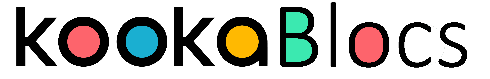

""""""""""""""""""""""""""""""""""""""""""""
Welcome to the KookaBlocs Reference Guide!
""""""""""""""""""""""""""""""""""""""""""""

**KookaBlocs** is a powerful visual scripting editor and prototyping tool designed for the **Kookaberry** and Raspberry Pi Pico microprocessors 
running **Kookaberry** firmware. 
This editor runs within Chrome, Vivaldi or Edge web browsers as a Progressive Web Application (PWA) on Personal Computers using Microsoft Windows, 
Apple Mac OS, Linux and on Chromebooks.  
It features a drag-and-drop programming interface, making it beginner-friendly and highly intuitive.

This document describes how to use the **KookaBlocs** visual scripting development tool.

**KookaBlocs** and the **KookaCode** script editing tool were commissioned by the AustSTEM Foundation 
and created by Damien George for the **Kookaberry**.

This guide is for **KookaBlocs** v1.0.

The document is in TWO parts:

1. Working with **KookaBlocs** - relates to **KookaBlocs** set-up, basic screen displays and usage.
2. A Reference Document for the visual functional blocks in **KookaBlocs**.

.. toctree::
   :caption: Contents

   part1.rst
   part2.rst
   glossary.rst

:Example Scripts:

   All the scripts used in this guide are available for downloading from Github and following the instructions on the `README`_ page:

.. _README: https://github.com/TDStrasser/KookaBlocs-Reference/tree/main/examples

:Errata:

   If errors or issues are found in the **KookaBlocs Reference Guide** please `post an issue on GitHub`_.

.. _post an issue on GitHub: https://github.com/TDStrasser/KookaBlocs-Reference/issues

:Copyright:

   Blockly is a library from **Google** for building beginner-friendly block-based programming languages.

   **Kookaberry** and **Kooka** are trademarks of Kookaberry Pty Ltd, Australia.

   The **Kooka Firmware** release v1.10.0, **KookaBlocs** and **KookaCode** were created by Damien George (George Electronics Pty Ltd – **MicroPython**) 
   in collaboration with Kookaberry Pty Ltd and the AustSTEM Foundation Ltd.
