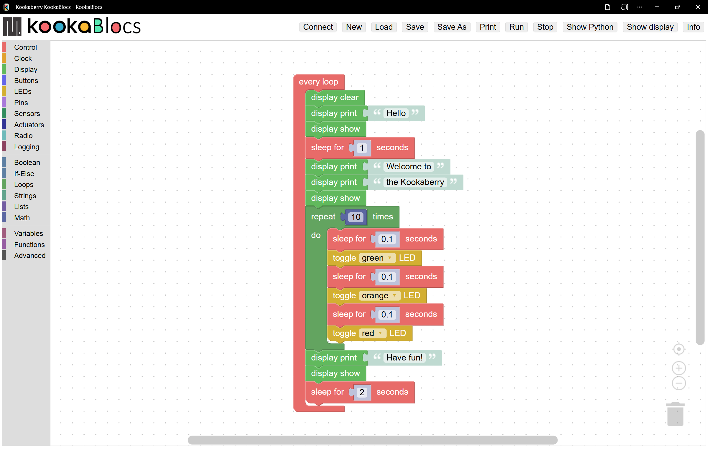

Introduction to KookaBlocs
============================

KookaBlocs: Visual Programming Editor for Kookaberry Microprocessor Boards
----------------------------------------------------------------------------

**KookaBlocs** is a powerful visual editor designed for creating program scripts for **Kookaberry** and related microprocessor boards. 
This editor operates on a drag-and-drop interface, making it beginner-friendly and highly intuitive. 
It's built upon the open-source Google Blockly library (Apache 2 license), created by Google to facilitate the development of beginner-friendly programming languages.

:numref:`welcomescript` shows a **KookaBlocs** script assembled from visual function blocks dragged onto the **Workspace** 
from the palette of blocks on the left of the display.  
The blocks click together like pieces of a jigsaw puzzle to form a series of steps that the **Kookaberry** microcomputer will perform.

.. _welcomescript:

   This is the **KookaBlocs** display with an example **KookaBlocs** script. 

The example shown above shows a loop that writes a welcome message on the **Kookaberry** display and flashes the **Kookaberry**'s **LEDs**.  
It then sleeps for 2 seconds and then goes back to the beginning of the loop.  The loop will run until the **Kookaberry** is reset or power is removed.

**KookaBlocs** was created by Damien George (George Robotics – MicroPython) in collaboration with Kookaberry Pty Ltd. 
It also received support from the AustSTEM Foundation, the Warren Centre, and the Vonwiller Foundation.

Key Features
------------

Intuitive Visual Interface: 
    Users can create syntactically correct scripts and programs effortlessly, 
    even without prior knowledge of any programming language.

    **KookaBlocs** enables users to assemble visual blocks into structured **MicroPython** (Python 3.0) code.

Compatibility: 
   The generated code can be utilized on most microprocessor boards that use **MicroPython**, 
   but is particularly suited to those with **Kookaberry** firmware for **STM**, **RP2040** and **RP2350** microprocessors.

Platform Compatibility: 
   **KookaBlocs** runs as a Progressive Web Application (PWA) within the Google Chrome we browser and browsers that are based on Chrome. 
   Any personal computer that supports the Chrome web browser can be used.  This includes PCs running **Microsoft Windows** 10 or 11, 
   **Apple MacOS**, **Linux**, **Chrome OS** (Chromebook), and **Raspberry Pi Raspbian** operating systems.

Easy Access: 
   The latest version of **KookaBlocs** can be conveniently downloaded from the AustSTEM website  
   at https://auststem.com.au/KookaBlocs.

   Follow the :doc:`installing` guide in the next section to initiate and, for offline use, to install **KookaBlocs**.

Programming With KookaBlocs
-----------------------------

Using **KookaBlocs** is straight forward and enjoyable. 

Users can drag and drop visual code blocks into the **Workspace**, where they can be seamlessly interlocked or snapped together using sockets. 

These sockets represent fundamental code concepts, including program controls (activation, termination, loops, and decisions), actions, and result computations (variables, values, mathematical and logical expressions). 

The intuitive visual process empowers users to apply programming concepts and principles when designing scripts or programs, eliminating the need to worry about the syntax and semantics of MicroPython. 

With **KookaBlocs**, programming becomes an enjoyable and accessible endeavour.

AustSTEM Learning Hub
---------------------

AustSTEM has assembled a collection of resources on its Learning Hub at https://learn.auststem.com.au.  
These resources complement the material in this manual with examples, lesson plans, descriptions of equipment and of their application.