Using the KookaBlocs Application
================================

Launching KookaBlocs using a compatible browser on a personal computer will result in the display shown:

.. _kblocsdisplay:
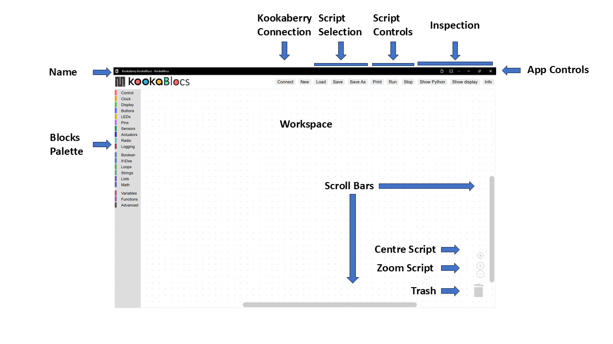

   This is the **KookaBlocs** display with the controls labelled.
   
The application window has numerous controls, as are described below:

Name
----

The PWA name **KookaBlocs** is shown at the top-left of the **KookaBlocs** window.

.. note::
  
   The latest version of **KookaBlocs** can be conveniently updated from the website by refreshing the browser window using the key combination ctrl-R.
 
   See the section :doc:`installing` for instructions on installing / uninstalling **KookaBlocs** on the various supported we browsers.

App Controls
------------

These controls allow the **KookaBlocs** window to be minimises or maximised, and the **KookBlocs** application to be exited.  

Depending on the web browser being used, there may be other controls for browser settings and functions. 
:numref:`pwactrls` shows the appearance of these controls for the Microsoft Edge browser.

.. _pwactrls:
.. figure:: images/pwa-controls.png
   :width: 100
   :align: center

   The KookaBlocs PWA Controls

.. important::
  If the KookBlockly script has not been saved before attempting to exit **KookaBlocs** will exit anyway - 
  it does not keep track of whether there are unsaved edits.  Please be careful to regularly save your work!

Resizing of the window can also be accomplished by clicking on the window edges and dragging to resize.

Workspace
---------

In the centre of the window is the **KookaBlocs** **Workspace**.  

Blocks can be dragged into this space, repositioned, resized and deleted by using the mouse or track-pad or pointing device.

Blocks Palette
--------------

Down the left of the window is a vertically-oriented list of the **KookaBlocs** palette categories, shown in :numref:`blkspalette`. 

Click on any category to reveal the palette of blocks, click on and drag the desired block to the **Workspace**, 
position it and release to drop the block in place.  The blocks palette will then automatically close.

To close the blocks palette without dragging a block into the **Workspace**, either click on the palette icon used to open the palette,
or press the ``Esc`` key.

.. _blkspalette:
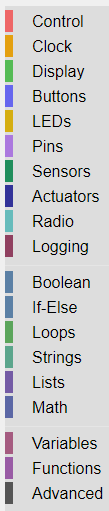

   The Blocks Palette showing the Block Categories

The block categories and blocks are fully described in the :doc:`part2` section.

Script Controls
---------------

At the top of the window, a set of buttons with which **KookaBlocs** scripts may be created, loaded, saved, run, stopped, and inspected. See :numref:`scriptbtns`.

.. _scriptbtns:
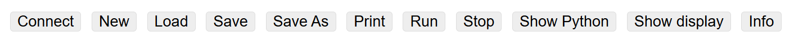

   The **KookaBlocs** Script Control Buttons

The functions of each of the **KookaBlocs** Script Control buttons are:

Connect
  Clicking the Connect button opens a dialogue window which shows which serial USB ports are available and which is 
  connected to a tethered **Kookaberry**. Plugging in a **Kookaberry** usually automatically assigns a USB serial port.
  Select the serial port by clicking on it and then click the Connect button.

See :numref:`serialselect`.

.. _serialselect:
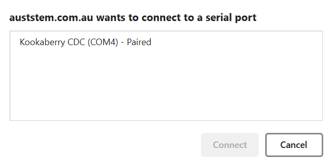

   The Serial dialogue showing the available and used USB serial connection ports

New
  Empties the **Workspace** to start a new script. 
  If the current **Workspace** contains script blocks, then a prompt to confirm that all existing blocks be deleted is given as shown in :numref:`newprompt`.

.. _newprompt:
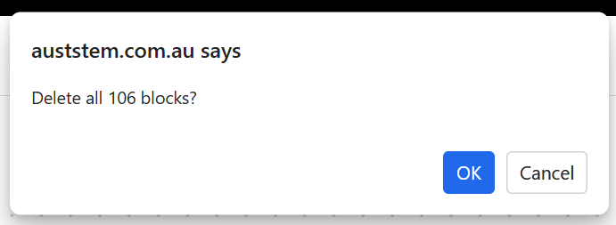

   Prompt dialogue to clear the **Workspace**. 

Load
  The **Load** button allows the user to select a **KookaBlocs** program to be loaded into the **Workspace**, 
  appending it to the current script.  This feature enables the assembling of scripts by combining separate script files.

  Move the cursor to this button, press click on the mouse and the dialogue in :numref:`loaddialg` will be displayed:

.. _loaddialg:
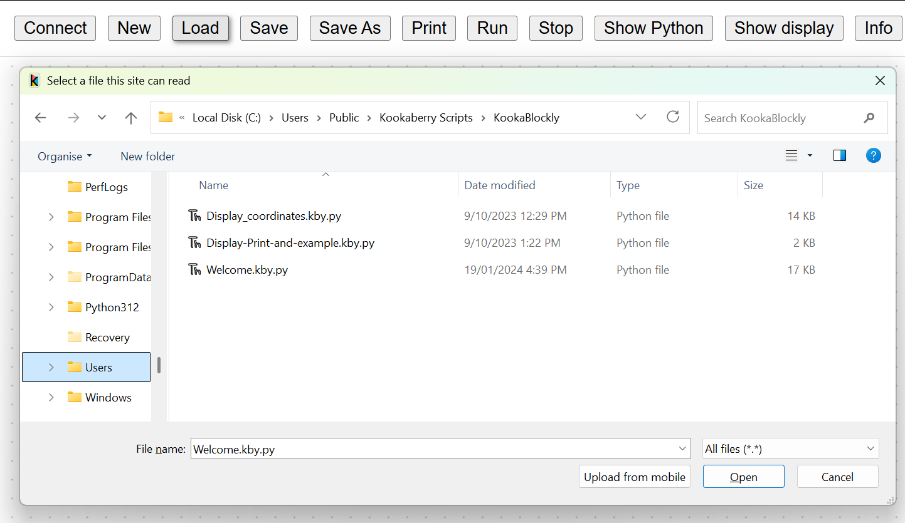

   **KookaBlocs** script load file selection dialogue. 

**KookaBlocs** script files usually have a type designation of ``.kby.py``.

Selecting a script and pressing the dialogue's **Open** button, or alternatively double-clicking on a selected **KookaBlocs** script file 
will place a copy of that script in the **KookaBlocs** **Workspace** from where it can be modified, saved and run on the **Kookaberry**.

.. important::
    
   When assembling scripts from a number of files, the name of the last loaded file becomes the default for saving the script.  If the script is intended to be saved into a new or differently-named file then use the **Save As** button to give a different name to the file.

Save 
  Scripts that are loaded or created are regarded as newly-created scripts.  This is because the **Load** action imports blocks onto the script
  **Workspace** adding to any blocks that are already present.
  
  The **Save** button has two behaviours:

  1. On the first click it will open the Save As file dialogue in which the location and name of the script file is entered. There are some confirmation dialogues that will then occur. These are more fully described in Save As description.
  2. Thereafter, the currently open script will be save into the same file with a confirming dialogue. Click on the **OK** button to close the dialogue.

.. _filesaveddialg:
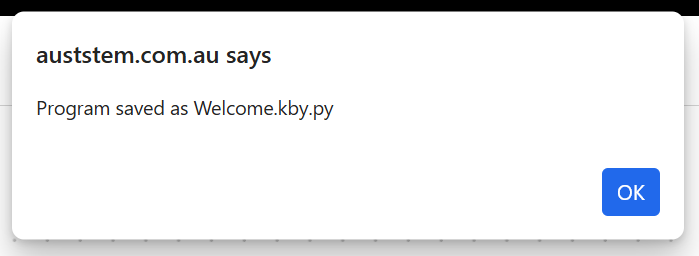

   **KookaBlocs** file saved confirmation dialogue. 

Save As
  Saves the current script to a new file within a selected folder.

  Move the cursor to this button, press click on the mouse and the file dialogue in :numref:`savedialg` will be displayed:

.. _savedialg:
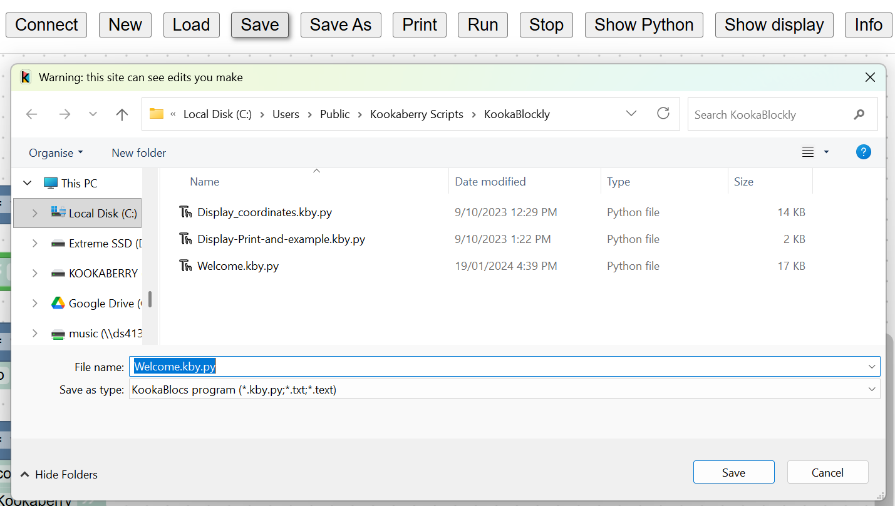

   **KookaBlocs** script Save / Save As file selection dialogue. 

  
  **KookaBlocs** script files have a type designation of ``.kby.py``.

The default file name will be the name of the last file loaded, or if the script is newly created will be ``program.kby.py``. 
 
If required, edit the new file's name and press the dialogue's **Save** button to save the current script to the file.  

If the file already exists, another dialogue shown in :numref:`filereplacedialg` will open asking to confirm whether the existing file is to be replaced.  
Press **Yes** to overwrite the file, or **No** to go back and change the intended file name. 
Please note that the appearance of this dialogue is dependent on the browser and operating system being used.

.. _filereplacedialg:
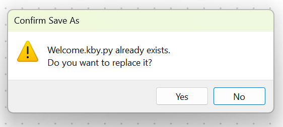

   **KookaBlocs** existing file name dialogue. 

A second confirmation dialogue will then appear warning that a Python file can be dangerous and that it should only be saved if the KookaBlocs app is trusted.
Confirm the save by clicking the **Save** button, or cancel the save by clicking **Don't Save**. By cancelling, the script will not have been saved.

.. _saveconfirmdialg:
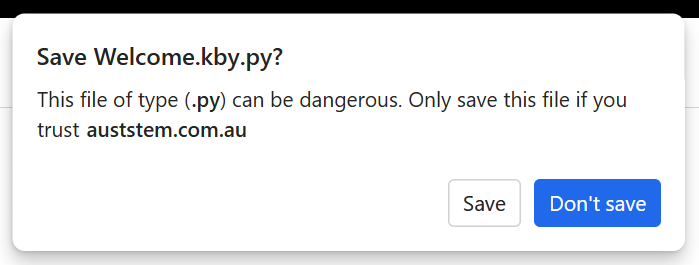

   **KookaBlocs** confirm file save dialogue. 

Subsequent script edits in the current editing session can be saved into the already identified file by clicking on **Save**.

Print
  Prints the current view of the script in the **Workspace**, *which may not be the whole script*.  
  Using the **Zoom** buttons and **Scroll Bars**, adjust the view of the script to suit the printout desired.

  When the **Print** button is clicked, a Print dialogue (per the operating system convention) appears as in :numref:`printdialg`.

  Choose the print options, which again are specific to the PC operating system and the installed printer, 
  and then press the **Print** button to finalise printing options and then printing to the chosen printer.  

  Print options may include paper size, paper orientation, scaling, multi-page layout, printer selection and printer setup.

.. _printdialg:
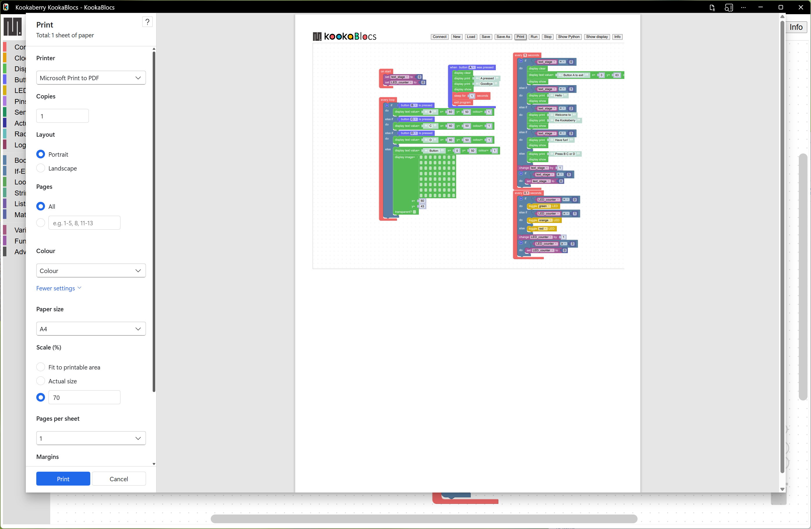

   **KookaBlocs** script Print dialogue. 

Run
  Transfers the current script to the tethered **Kookaberry** and runs the script on the **Kookaberry**.

  If a Kookaberry has not been already connected, the **Connect** dialogue will first appear.

Stop
  Terminates the script currently running on the tethered **Kookaberry**.

Show Python
  This button opens a window, shown in :numref:`showscript`, 
  in which the MicroPython script generated by the loaded **KookaBlocs** script is displayed.  

  The size of the window showing the script can be adjusted by clicking on and dragging the edges of the script window using the cursor.

  The MicroPython is read-only and cannot be edited within this window.

  This window presents a live view of the generated MicroPython script and it is possible to watch the MicroPython script being dynamically 
  altered as the **KookaBlocs** script is being edited. You must position this window so it stays visible and 
  not obscured by the **KookaBlocs** **Workspace** window to continue to observe the script changes.

.. _showscript:
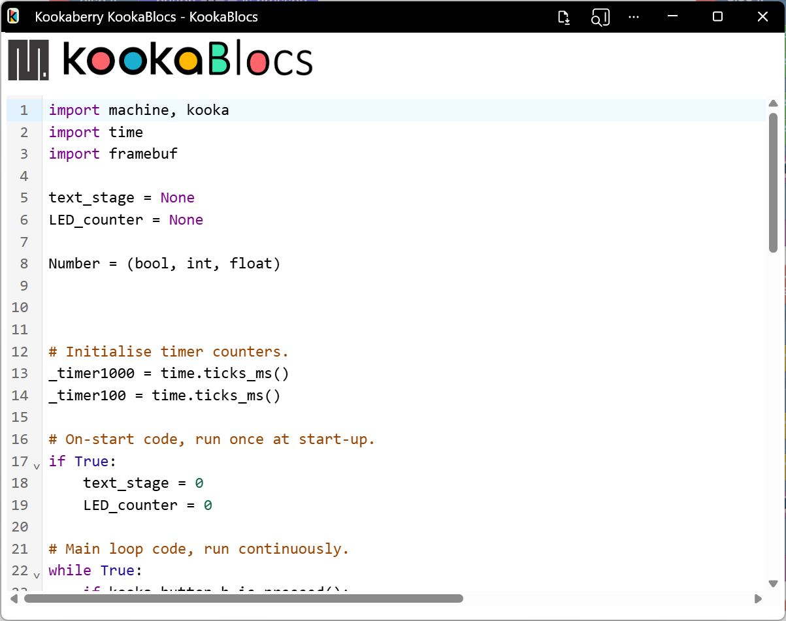

   **KookaBlocs**-generated MicroPython script window

Show display
  This button which will open a window, shown in :numref:`showdisplay`, on which the attached **Kookaberry** is shown in virtual form.  
  This includes the **Kookaberry**'s display, **LEDs**, buttons A to D and reset, and a button to start the **Kookaberry**'s internal menu.

  The display will mirror the physical display on the **Kookaberry**.

  The **LEDs** will change colour to mirror illumination of the real **LEDs** on the **Kookaberry**.

  The buttons can be clicked using a mouse or track-pad on the PC, and will respond in the same way as the physical buttons on the **Kookaberry**.

.. _showdisplay:
.. figure:: images/kblocs-show-display-window.png
   :width: 300
   :align: center

   Virtual **Kookaberry** window

.. note::
  
   It is also possible to load **Kookaberry** firmware onto standard Pi Pico microcomputer boards.  
   These boards do not have the physical **Kookaberry** display, LEDs or buttons.  

   In this case the virtual **Kookaberry** window can be used to view and operate the **Kookaberry**'s user interface.
   
   1. the “Kookaberry Reset” button replicates the hardware Reset button the Kookaberry
   2. the “Kookaberry menu” button replaces the “hold down button B and press and release Reset” on a physical Kookaberry
   3. the three **LEDs** replicate the three hardware **LEDs** on the Kookaberry
   4. the four buttons A, B, C and D, replicate the physical buttons on the KookaBerry

Info
  The **Info** button will open a dialogue with three buttons:

  1. **About** will show a short descriptive text About **KookaBlocs**
  2. **Disclaimer** will show a short legal disclaimer and the terms of use for **KookaBlocs**.
  3. **Documentation** will show the links to **KookaBlocs** and related documentation, including to this Reference Guide.

  To close the dialogue, click on the small exit icon or click on the **KookaBlocs** **Workspace**.

.. _showkblocsinfo:
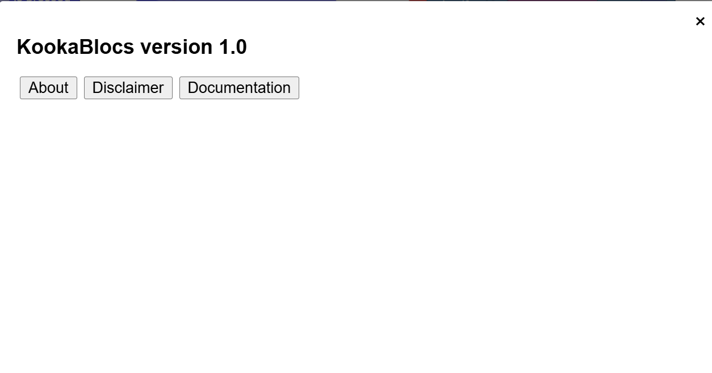

   **KookaBlocs** info window

Scroll Bars, Centre, Zoom and Trash
-----------------------------------

At the bottom-right of the window is a set of control icons as shown in :numref:`zoomtrash`.

.. _zoomtrash:
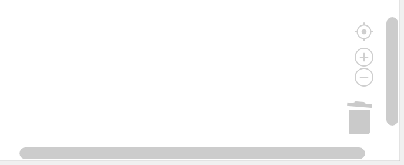

   Control icons at the bottom right of the **KookaBlocs** window

Centre Script
  for centering the **KookaBlocs** script.
  Clicking on the Centre icon will centre the script in the **Workspace** and zoom it to fit the **KookaBlocs** window.

Zoom Script
  for changing the visual size of the **KookaBlocs** script by zooming in and out.

  * Click on the `+` icon to zoom in and visually enlarge the script.
  * Click on the `-` icon to zoom out and visually shrink the script.
  

Trash
  For the duration of a script editing session, deleted blocks are placed in the **Trash**. 
  It is possible to retrieve deleted blocks from the **Trash**, but only during the current editing session.  

  * Click on the **Trash** icon to open it and show the blocks that have been deleted in the current editing session.
  * To retrieve a block from the **Trash**, click on the block and drag it back into the **Workspace**.
  * To close the **Trash** press the ``Esc`` key.

  When **KookaBlocs** is closed the contents of the **Trash** are deleted.

Scrollbars
  there are horizontal and vertical scrollbars for positioning the **KookaBlocs** **Workspace** within the window.  

  Click on a scrollbar and drag it up/down or left/right as appropriate to reposition the **Workspace** in the **KookaBlocs** window.

 